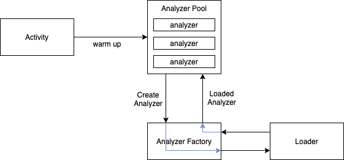
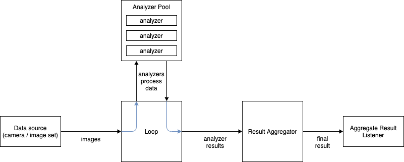
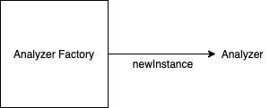
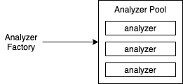
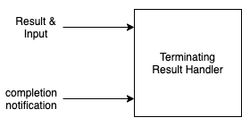
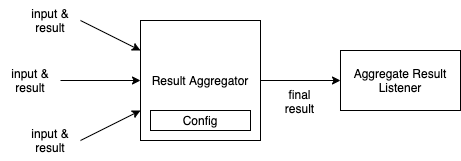
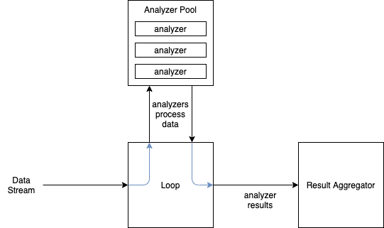

# Overview

This document outlines the architecture that makes up the basis of the Scan framework. The following concepts form the bases of the framework:

1. [Analyzers](#analyzers)
1. [Results](#results)
1. [Loops](#loops)
1. [Loaders](#loaders)
1. [Stats](#stats)
1. [Camera](#camera)

The SDKs have two distinct phases.

1. [Warm Up](#warm-up)
1. [Data Processing](#data-processing)

## Warm Up

Warm up loads the analyzers into memory so that they can begin processing images immediately once they are available from the camera.

## Data Processing

Once the analyzers are loaded into memory, image processing may begin. Images from the [camera](#camera) or other data source are sent to a [loop](#loops) where they are analyzed in parallel by a [pool of analyzers](#analyzer-pool). The results from the analyzers are fed in parallel to a [result aggregator](#result-aggregator), where they are aggregated. Once complete, the final result is sent to the [aggregate result listener](#result-aggregator-listener).

# Analyzers

There are three basic concepts related to analyzers:

1. Analyzer
1. AnalyzerFactory
1. AnalyzerPool

Analyzers perform work. Analyzer factories create instances of analyzers. Analyzer pools use factories to create a pool of analyzers.

## Analyzer

Analyzers encapsulate a single processing unit. They take some form of input and a state, perform an operation on it, and return a processed result. For example, an analyzer might take a frame from the camera, process it, and return information about the contents of the image.

Analyzers are the primary workhorse of Scan. They are used to process data through various means such as ML model inference, static code, etc. An analyzer can also compose multiple other analyzers. For example, an image processing analyzer might contain instances of an object detection analyzer and an OCR analyzer, and run them in parallel to compute its output.

Analyzers provide a single method: [`analyze`](../scan-framework/src/main/java/com/getbouncer/scan/framework/Analyzer.kt#L16). This method takes the data and state as inputs and returns a processed output. This method processes data synchronously. Each analyzer executes in its own thread, and does not have to be thread safe. However, the `state` provided to an analyzer may be updated by other threads during execution.

## Analyzer Factory

Analyzer factories are classes that know how to create an instance of an analyzer. If the factory is marked as thread safe, it will be used by used to create multiple instances of an analyzer for multithreaded processing. If it is not marked as thread safe, only one instance of the analyzer will be created and data will be processed sequentially.

Analyzer factories provide one method: [`newInstance`](../scan-framework/src/main/java/com/getbouncer/scan/framework/Analyzer.kt#L25). This method creates a new copy of an analyzer.

## Analyzer Pool

Analyzer pools maintain a collection of analyzers of a given type. They are used primarily for "warming up" a predefined number of analyzers by loading them into memory and preparing them to process data. Analyzer pools use a factory to create a specified number of analyzers, and provide access to those analyzers once they are available.

Analyzer pools are used primarily by loops to provide a list of available analyzers to use to process data.

# Results

There are a few basic concepts related to results:

1. ResultHandler
    a. FinishingResultHandler
    b. TerminatingResultHandler
1. ResultAggregator

`ResultHandlers` process results (usually from [analyzers](#analyzers)). `ResultAggregators` are special implementations of a result handler that are configured with a `ResultAggregatorConfig` and aggregate results and pass the results to an `AggregateResultListener`.

## Result Handler

Result handlers at their most basic provide a method [`onResult`](../scan-framework/src/main/java/com/getbouncer/scan/framework/Result.kt#L18) which takes as parameters some data and the processed result of that data.

Result handlers are used to process a result from an analyzer and the input that created that result. They can be used to update UI, aggregate results, or start other tasks.

### State Updating Result Handler

A state updating result handler is a specialized implementation of a [`ResultHandler`](#result-handler) which has the ability to update the state of the loop that is using this handler.. Finishing result handlers provide an additional field [`listening`](../scan-framework/src/main/java/com/getbouncer/scan/framework/Result.kt#L69) which allows the code calling the result handler to determine if the result handler is still listening for results or if it has completed.

This is useful for result handlers which process data until a certain condition is met. For example, processing camera images until a card is detected.

### Terminating Result Handler

A terminating result handler is a specialized implementation of a [`ResultHandler`](#result-handler). Terminating result handlers provide additional methods [`onAllDataProcessed`](../scan-framework/src/main/java/com/getbouncer/scan/framework/Result.kt#L85) and [`onTerminatedEarly`](../scan-framework/src/main/java/com/getbouncer/scan/framework/Result.kt#L90).

The method `onAllDataProcessed` allows the code calling the result handler to inform the result handler that it has received all of the available results. This is useful for result handlers that are processing a known amount of data.

The method `onTerminatedEarly` lets the result handler know that it will receive no more results, but not all of the available results were processed. This is useful for result handlers that are processing a known amount of data, but might halt that processing early due to time constraints.

## Result Aggregator

A result aggregator is a specialized implementation of a [`FinishingResultHandler`](#finishing-result-handler). The result aggregator processes results until a specified time has elapsed, enough data frames have been saved, or other conditions have been reached. Result aggregators use a result aggregator config to determine some aspects of their behavior.

Result aggregators must implement the following methods:
* `aggregateResult` - Given an individual result, aggregate it. This should return a final result once aggregation is complete.
* `isValidResult` - Determine if a given individual result is valid and should be aggregated.
* `getSaveFrameIdentifier` - Classify a given data frame to be saved for later.
* `getFrameSizeBytes` - Get the size in bytes of a data frame.

### Result Aggregator Listener

Result aggregators communicate their state via a `ResultAggregatorListener`. Result aggregator
listeners must implement the following methods:
* `onResult` - The aggregated result is available.
* `onInterimResult` - An interim result is available, but the result aggregator is still processing more data frames. This is useful for displaying debug info.
* `onInvalidResult` - An invalid result was received, but the result aggregator is still processing more data frames. This is useful for displaying debug info.
* `onUpdateProcessingRate` - The processing rate has been updated. This is useful for debugging and measuring performance.

# Loops

Loops use [analyzer pools](#analyzer-pool) to process data from a stream in parallel and [result handlers](#result-handler) to perform post-processing actions.

Loops contain a shared state that can be updated by the result handler, and can be read by all instance of the analyzers in the analyzer pool. 

There are two kinds of loops:
* ProcessBoundAnalyzerLoop
* FiniteAnalyzerLoop

## Process-bound Analyzer Loop

Process-bound analyzer loops take an indefinite stream of data (such as images from a camera) and process the data using a pool of analyzers. These loops use a [state updating result handler](#state-updating-result-handler) to handle the results from the analyzers, and will run until the analyzer is no longer listening for results.

When the finishing result analyzer stops listening, the loop terminates.

## Finite Analyzer Loop

Finite analyzer loops take a known amount of data (such as a specific set of images) and process the data using a pool of analyzers. These loops use a [terminating result handler](#terminating-result-handler) to handle results from the analyzers, and will run until all of the data has been processed or they exceed a specified maximum processing time.

# Loaders

Loaders are classes that load data from some data source into a `ByteBuffer`. These are particularly useful for executing ML models stored on disk or downloaded from the web. Loaders are often used by [analyzer factories](#analyzer-factory) for creating instances of ML inference engines.

Loaders have one method: `loadData` which takes no inputs, and returns a loaded `ByteBuffer`.

## Resource Loader

Resource loaders open files on the local disk and load them into memory. This is useful for ML models that are included with the SDK, such as SSD OCR.

## Web Loader

Web loaders download data from the web and load it into memory. This is useful for ML models that are not included with the SDK, such as object detection.

Web loaders will attempt up to 3 times to download a single file before caching the failure. Subsequent requests to download the same file will use the cached error instead of making a network call.

# Stats

Stats are used for diagnostic purposes throughout the app. These stats allow Bouncer Technologies, Inc to identify problems with the SDK, such as poor performance on certain devices, poor user experiences, bugs, etc.

Stats will include details about the device, including the following:
* IDs (android_id)
* name (manufacturer and model)
* boot count
* locale
* carrier
* network operator
* phone type
* phone count
* OS version
* platform ("android")
* app package name
* application id
* library package name
* CardScan version

Stats are global to the SDK, and allow tracking individual or repeating tasks at any point in the SDK. Stats keep a running list of tasks and their results, which are sent to bouncer servers at the conclusion of a scan.

## Single Tasks

When tracking a single task with one or more results, call `Stats.trackTask("<task_name>")` to get a `StatTracker` object. When the task is completed, call `statTracker.trackResult("<task_result>")`. Task stats will keep track of the start time, duration, and result of the task.

## Repeating Tasks

To track a task that repeats (e.g. an analyzer execution), call `Stats.trackRepeatingTask("<task_name>")` at the beginning of each instance of the repeating task to get a `StatTracker` object. When the single instance of the repeating task completes, call `statTracker.trackResult("<task_result>")`.

Repeating task stats will track the count of each kind of result from the repeating task, as well as the total CPU time, total real time, and min/max/avg execution time for each instance of the task.

# Camera

The SDK uses `CameraAdapters` to stream data from a camera API to a [process-bound analyzer loop](#process-bound-analyzer-loop). These adapters can make use of Camera 1, Camera 2, or Camera X APIs. When images are available from the camera in `Bitmap` format, the images are sent to the loop via the `processFrame` method on the loop.

Camera code exists in the [UI](https://github.com/getbouncer/cardscan-ui-android) module.
